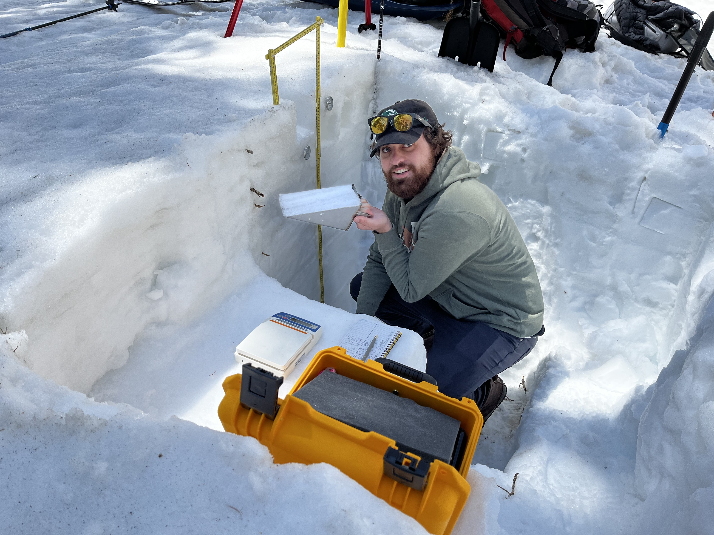

---

output: html_document

---

```{r setup, include=FALSE}
knitr::opts_chunk$set(echo = FALSE,warning = FALSE,message = FALSE)
```


Heres My website.


<span style="font-size: 20pt;">My name is Andrew Knowlton 

I am a Geography Major here at UVU </span>

I am more in the technical side of Geography doing GIS and am working on a big Research Project for the next year with URSCA funding looking at the dust in the snow pack in the Wasatch and Uintah range heres a pic of me doing some snow research with Dr. Matt Olson here at UVU . 




I am working to get an occupation doing environmental research with field work, GIS and Remote Sensing.

GIS requires lots of data management and analysis so This year i have been taking a R studio class to get better at data management for GIS . 

<span style="font-size: 30pt;">Here Is my Final Project </span>

https://rpubs.com/Andrewknowlton17/1036146


